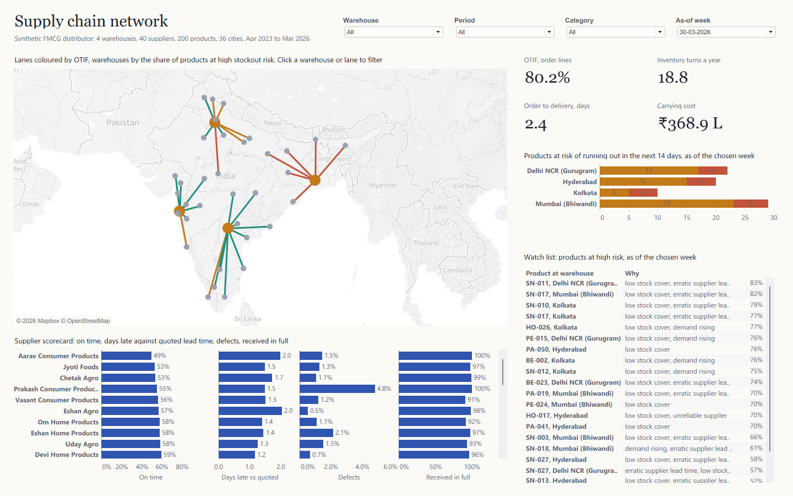

# Supply Chain Network

An end-to-end supply chain case study: three years of a simulated FMCG distributor across India, modelled and tested in DuckDB, a stockout risk model measured against the reorder-point rule, and a Tableau dashboard, map first, generated entirely from code.

**[Open the live dashboard on Tableau Public](https://public.tableau.com/app/profile/daman.reddy/viz/SupplyChainNetwork_17913286536000/Network)**

**[Read the full case study (PDF)](docs/case-study.pdf)**, or the [web version](docs/case-study.html) for a portfolio site.
Reviewing the code? Start with **[How it works](docs/how-it-works.pdf)**, a stage-by-stage guide with the design choices worth challenging.



## What it answers

| Question | Where |
|---|---|
| Are we delivering on time and in full, and where not? | OTIF KPI, lanes on the map coloured by OTIF |
| How fast do orders arrive? | Order-to-delivery KPI, lane tooltips |
| How hard is our stock working, and what does it cost to hold? | Inventory turns and carrying cost KPIs |
| Which products are about to run out, and why? | Products at risk per warehouse, watch list with reasons, as of any week |
| Which suppliers are letting us down? | Supplier scorecard: on time, days late against quoted lead time, defects, received in full |

The map is the navigation: click a warehouse or lane to filter every other view to that warehouse; click empty map to clear it. Period, category and as-of week parameters drive everything.

## Headline findings (synthetic distributor)

- Kolkata delivers 59.0% of order lines on time and in full, against 83 to 87% at the other three warehouses: dispatch queues, and the monsoon (on time 27 to 32% from July to September).
- Varanasi, the farthest city Kolkata serves (815 km), is promised two days of transit like cities half as far; deliveries take 4.2 days against a promise of three.
- Snacks supplier Prakash Consumer Products fell from 75% to 40% on time after July 2024, with the highest defect rate (4.8%).
- The Diwali pre-build cut snacks out-of-stock days in October and November from 4.2% to 1.6%, for about 16% more stock from September to November.
- The stockout model (gradient boosting, out-of-time test) reaches ROC AUC 0.840 against 0.699 for the reorder-point rule; flagging the same share of products, it catches 65.6% of stockouts against 59.5%.

## How it's built

```
src/generate.py           seeded day-by-day simulation: orders, dispatch, replenishment, suppliers; 10 ERP and WMS exports
sql/01_staging.sql        typed staging, day-first dates parsed, supplier names cleaned
sql/02_model.sql          order lines, purchase orders, daily demand and daily stock with value and carrying cost
sql/03_features.sql       weekly stockout snapshots, 14-day label, feature list
src/model.py              stockout model, comparison with the reorder-point rule, calibration, reasons
sql/04_marts.sql          one long table for Tableau, including the lane geometry for the map
sql/checks.sql            15 checks; the export is blocked if any fails
src/pipeline.py           builds DuckDB, trains the model, runs the checks, exports 8 tables to data/model
src/mutation_test.py      breaks the data on purpose, once per check, and confirms each check catches it
tableau/build_twb.py      generates the Tableau workbook (.twbx with a Hyper extract) from the schema
tableau/filter_check.py   expected dashboard numbers for any parameter values, computed in DuckDB
tableau/*.ps1             open, capture and crop helpers for Tableau Public
```

Every number is checked twice: the SQL checks reconcile the data (stock balances day to day for every product at every warehouse, orders follow the network, the model's label and features hold), and the dashboard's numbers were compared with DuckDB for the whole network and two filtered views.

## Run it

Requirements: Python 3.12+, Tableau Public 2026.2 (free; Windows tested).

```bash
python -m venv .venv
.venv/Scripts/pip install -r requirements.txt
.venv/Scripts/python src/generate.py
.venv/Scripts/python src/pipeline.py
.venv/Scripts/python tableau/build_twb.py
```

Then open `tableau/Supply Chain Network.twbx` in Tableau Public. The data travels inside the file.

## Data

All data is synthetic: the distributor, its suppliers, retailers, orders and stock are simulated. No real company data is used.
